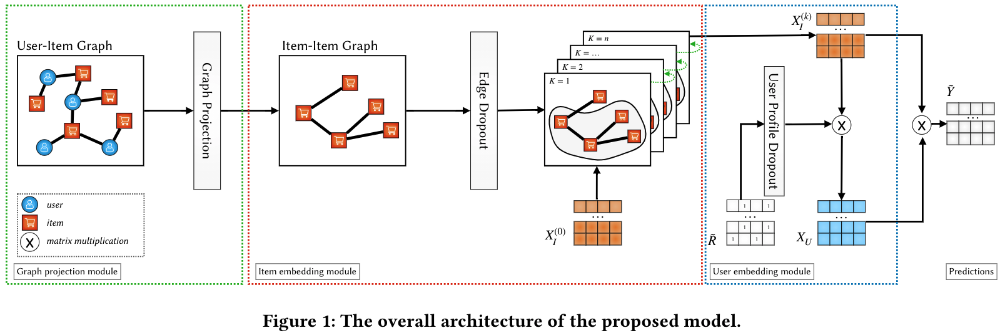

# UI-GCCF

### Requirements
To install all the required packages using the following command:
	
	$ pip install -r requirements.txt

### Datasets
To run the provided code is necessary to download and pre-process the datasets. To download and  preprocess one dataset run command:

    $ python datasets/create_split.py --dataset="Movielens1M"
    
The available Datasets are: **LastFM, Movielens1M, AmazonElectronics, Gowalla**.
*Note:* The dataset will be preprocessed using the exact random seeds used to obtain the results presented in the paper to let the experiments be completely reproducible.

### Train models
All the experiments have been done exploiting *weight and biases (wandb)* https://wandb.ai. 
To train a `model` using the validation set, run the following command with the proper args:

    $ python models/tensorflow/train_model/model/train_model.py --epochs="1000" --val_every="10" ...

Available models are: **matrix_factorization_bpr, lightgcn, ngcf, uigccf**

### Evaluate models
To evaluate the performance of a model onto the test set run:

    $ python uigccf_experiments/eval_trainval.py --algorithm="uigccf"

### Experiments
All the experiments file are stored inside `uigccf_experiments` folder
##### Ablation studies
* uigccf_experiments/ablation_studies/`convolution_depth.py`
* uigccf_experiments/ablation_studies/`edge_dropout.py`
* uigccf_experiments/ablation_studies/`top_k_pruning.py`
* uigccf_experiments/ablation_studies/`user_profile_dropout.py`

Files to plot the results are store inside `uigccf_experiments/ablation_studies/plot`
##### User profile length performance
* uigccf_experiments/`user_profile_length_performance.py`

##### Inductive performance 
* uigccf_experiments/`inductive_performance.py`

File to plot the results `uigccf_experiments/plot/plot_inductive_user_performance.py`